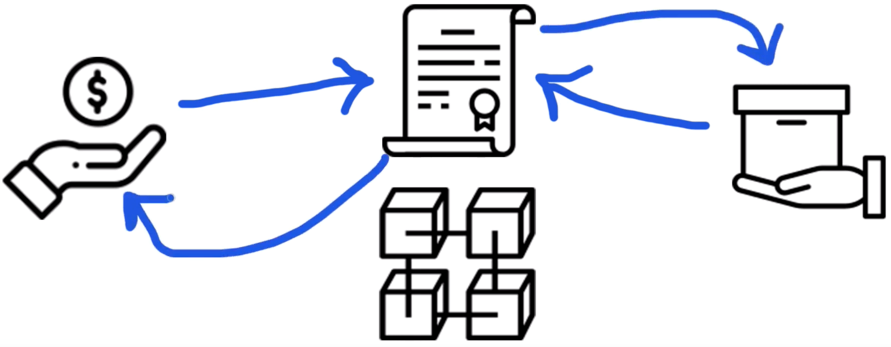
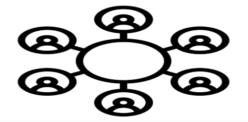
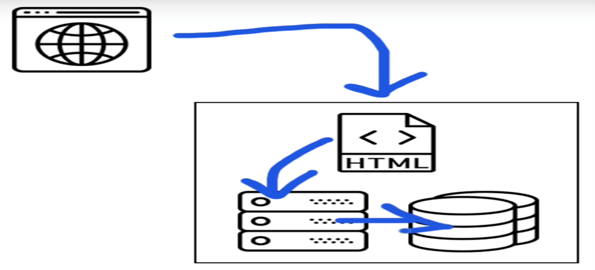
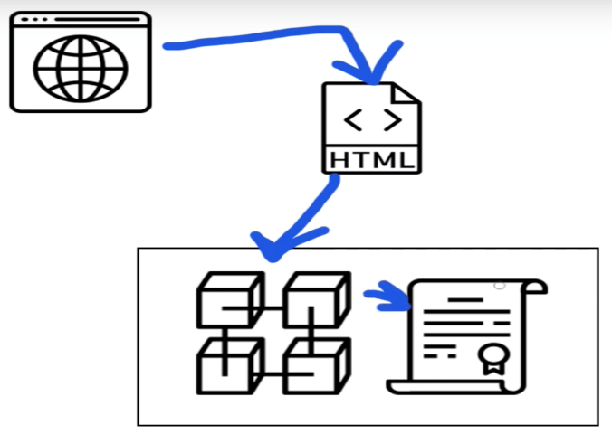
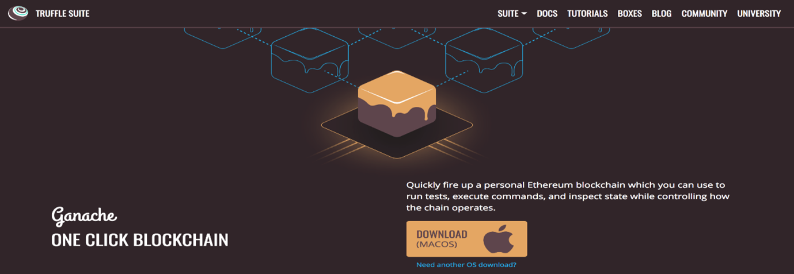
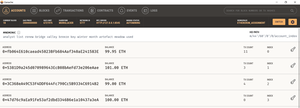
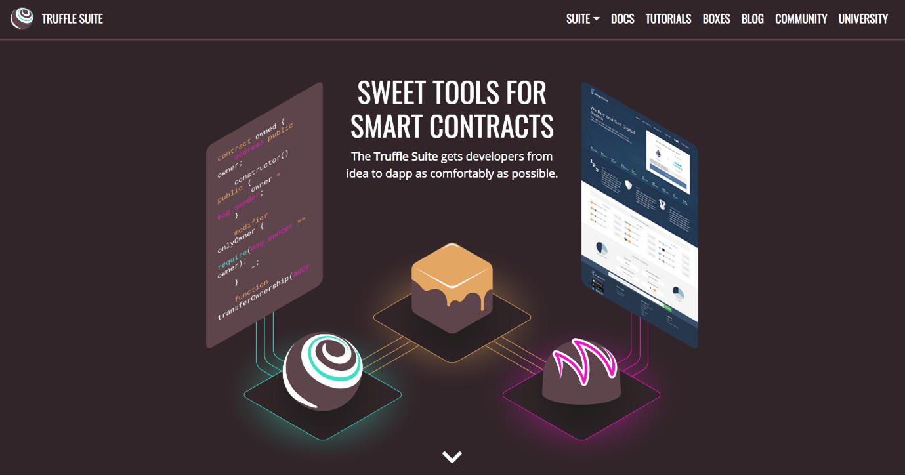
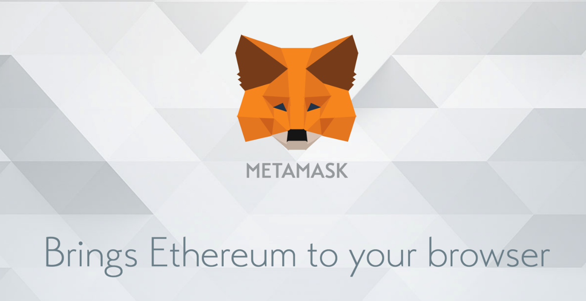

I’m going to show you how to create a blockchain application with Ethereum, Web3.js, and Solidity smart contracts. We don’t have to know anything about blockchain to follow along. I’ll let you from scratch. Use this step-by-step guide with code examples and written instructions to start.
What Are We Going To Build? 
  I’m going to show you blockchain programming from square one by building a complete application that’s powered by the blockchain.
We'll create:
1.	Ethereum smart contracts with the Solidity programming language
2.	We’ll write tests for the smart contracts in JavaScript
3.	We’ll deploy to the smart contracts to a blockchain
4.	We’ll create a client side website with Web3.js and React.js so that users can talk to the smart contracts
Don’t worry if you don’t know these languages, I’m going to show them as I go.
Let’s look at the application that we’re going to build. (show the execution of the project)
--------------------------------------------------------------------------------------------------------------

This is a marketplace that runs on the blockchain, kind of like Craigslist(A website of classified ads and community notices that serves an urban area.). It allows people to list items for sale, but unlike Craigslist, it also allows people to purchase them on the website with cryptocurrency.

  
Whenever someone purchases the item, they instantly become the owner. That’s because this application is powered by a smart contract on the blockchain which manages the market place. It tracks who owns the items for sale, and it transfers the ownership of the items automatically anytime someone purchases them with cryptocurrency. It works like a vending machine.
Let me break that down in case any of that's confusing. Let me answer a few basic questions.
What Is A Blockchain?
A blockchain is a peer-to-peer network of nodes that all talk to one another. These nodes are essentially computers that share responsibilities similar to web servers, like running programs and storing data that can be accessed whenever you're connected to the blockchain. All the nodes work together to create a public network that anyone can connect to.
You can think about a blockchain in a few ways:
•	One giant world-wide computer made up of smaller computers (nodes) that work together.
•	A network that anyone can connect to to send money, run programs, etc...
•	A database that allows you to store and retrieve information.
Blockchains assume responsibilities that web servers normally do like:
•	Running application code
•	Hosting a databse
 
 
However, blockchains work differently from traditional web servers. All of the code and data on the blockchain is decentralized, that is, it's distributed across all the nodes in the network. It does not lie on a central web server.
All of this data is contained in bundles of records called blocks which are chained together to make up the public ledger. All of the nodes on the network participate in ensuring that this data remains secure an unchanged. That’s what makes the blockchain so powerful.
So how do you connect to blockchain and use it?
Since it’s a network of nodes, you can either run your own node, or connect to one. Once you do, you’ll be able to access the full power of the blockchain.
 
What Is A Smart Contract?
Smart contracts the building blocks we use to create blockchain applications. They are programs that we can write with source code and deploy to the blockchain. They are written in the Solidity programming language, which I’ll teach you in this project.
Smart contracts are immutable, which means that once they've been created they cannot change. Once a smart contract is deployed to a blockchain, its code cannot be updated like a normal application. That's because it represents a digital contract or agreement. After all, you wouldn't want any other real-world contract to change after it is created, would you?
You can think of a smart contract kind of like a microservice, or API, on the web. If the public ledger is like a database, then a smart contract is the layer that reads, writes, and executes business logic.
How Does A Smart Contract Work?
We’re going to write smart contract to power the marketplace in this Project. It's going to work kind of like a vending machine.
 
Any time someone buys an item in the marketplace, they’ll send Ethereum cryptocurrency to the smart contract. The smart contract will work like a vending machine by dispensing the item to the buyer, and transferring the cryptocurrency payment instantly to the seller.
 
How Does A Blockchain App Work?
In order to understand how a blockchain app works, let's first look at how a normal web application works.
 
Normally with a web application, you access a web page with your web browser. All the the HTML, CSS, and JavaScript code for this website lives on a central web server, and talks to a backend (written in any programming language), which also talks to database.
The blockchain application that we'll build in this project works differently.
 
We will access our blockchain application with a special web browser that talks to a front end website written in HTML, CSS, and JavaScript. Instead of talking to a backend web server, this website will talk directly to the blockchain. The blockchain will essentially be our backend, hosting all of the code and data for our decentralized marketplace.
Now that we've covered the basics, let's get started building our project.
Ganache Personal Blockchain
The dependency is a personal blockchain, which is a local development blockchain that can be used to mimic the behavior of a public blockchain. I recommend using Ganache as your personal blockchain for Ethereum development. It will allow you to deploy smart contracts, develop applications, and run tests. It is available on Windows, Mac, and Linux as as a desktop application and a command line tool.
 
I'll walk you through setting up the desktop application in this project. You can find the latest release for your operating system here. Once  downloaded the archived package, extract the installer and run through the setup steps. Once  installed it, you should see a this screen whenever you open it:
 
Now you have a personal blockchain network running. You can see some details about the server Ganache is running on, along with a list of accounts connected to the network. Each account has been credited with 100 ether. This is a huge time saver. If you were to you create your own personal blockchain network from scratch, or develop your application on a test network, you would have to create all 10 accounts manually and credit each account with ether. Thankfully Ganache has already done this for us so that we don't have to worry about it.
Node.JS
Now that you have a private blockchain running, you need to configure your environment for developing smart contracts. The first dependency you'll need is Node Package Manager, or NPM, which comes with Node.js. You can see if you have node already installed by going to your terminal and typing:
> node -v

Truffle Framework
Now let's install the Truffle Framework, which provides a suite of tools for developing Ethereum smart contacts with the Solidity programming language.
 
Here is an overview of all the functionality we'll get with the Truffle Framework:
•	Smart Contract Management - write smart contracts with the Solidity programming language and compile them down to bytecode that be run on the Ethereum Virtal Machine (EVM).
•	Automated Testing - write tests against your smart contracts to ensure that they behave the way you want them to. These tests can be written in JavaScript or Solidity, and can be run against any network configured by Truffle, including public blockchain networks.
•	Deployment & Migrations - write scripts to migrate and deploy smart contracts to any public Ethereum blockchain network.
•	Network Management - connect to any public Ethereum blockchain network, as well as any personal blockchain network you might use for development purposes.
•	Development Console - interact with smart contracts inside a JavaScript runtime environment with the Truffle Console. You can connect to any blockchain network that  specified within your network configuration to do this.
•	Script Runner - write custom scripts that can run against a public blockchain network with JavaScript. You can write any arbitrary code inside this file and run it within your project.
•	Client Side Development - configure your truffle project to host client side applications that talk to your smart contracts deployed to the blockchain.
 
Metamask Ethereum Wallet
Now it's time to turn your web browser into a blockchain browser. Most major web browsers do not currently connect to blockchain networks, so we'll have to install a browser extension that allows them to do this.
 
I'll the Metamask extension for Google Chrome. To install Metamask, visit this link or search for the Metamask Chrome plugin in the Google Chrome web store. Once  installed it, be sure that it is checked in your list of extensions. You’ll see the fox icon in the top right hand side of your Chrome browser when it’s installed. Reference the video walk through if you get stuck.
Metamask will also allow us to manage our personal account when we connect to the blockchain, as well as manage our Ether funds that we'll need to pay for transactions.
 
1: Project Setup
Create a Truffle Project
Install all the dependence 
1)	D:\blockchain_training\blockchain\marketplace>npm install

2)	D:\blockchain_training\blockchain\marketplace>truffle compile
3)	D:\blockchain_training\blockchain\marketplace>truffle migrate
4)	D:\blockchain_training\blockchain\marketplace>truffle console
5)	Crating basic blockchain and creating a smart contract .
4.1) truffle(development)> accounts =await web3.eth.fetAccounts()
4.2) truffle(development)> blockNumber = await web3.eth.getBlockNumber()
undefined
4.3) truffle(development)> blockNumber
4
4.4) truffle(development)> marketplace = await Marketplace.deployed()
Undefined
4.5) truffle(development)> marketplace
4.6) truffle(development)> name = await marketplace.name()
Undefined
4.7)truffle(development)> name
'Sumayya Ethereum assignment '
6)	D:\blockchain_training\blockchain\marketplace>truffle test
Using network 'development'.
7)	D:\blockchain_training\blockchain\marketplace>npm run start

 
*******************************************************************************
Next let's look at the truffle-config.js file:
require('babel-register');
require('babel-polyfill');

module.exports = {
  networks: {
    development: {
      host: "127.0.0.1",
      port: 7545,
      network_id: "*" // Match any network id
    },
  },
  contracts_directory: './src/contracts/',
  contracts_build_directory: './src/abis/',
  compilers: {
    solc: {
      optimizer: {
        enabled: true,
        runs: 200
      }
    }
  }
}
The primary responsibility of this file is to connect our project to the blockchain network. I've already set this up to connect to our Ganache personal blockchain, that is, 127.0.0.1:7545. I'll also mention that I've configured the structure of this project differently from Truffle's default file structure. I have moved the smart contracts to the src directory so that they can be accessed by our react application. You can see that configuration under the contracts_directory and contracts_build_directory settings.
**********************************************************************************
Now that we've seen the project structure, let's begin writing our smart contract by creating a new file in the contracts directory:
>touch src/contracts/Marketplace.sol
Inside this file, let's begin writing our smart contract Solidity programming language:
pragma solidity ^0.5.0;

contract Marketplace {

}
First, we start by declaring the version of the Solidity programming language that we want to use. Next, we declare our smart contract Marketplace. We'll add all of the smart contract code inside of the curly braces. Let's do this:
pragma solidity ^0.5.0;

contract Marketplace {
    string public name;

}
This code creates a "state variable", whose value will be stored on the blockchain. We'll call the variable name because we'll use it to store the name for the smart contract (just for testing purposes). Since Solidity is a statically typed programming language, we must declare the string datatype before declaring the variable. Finally, we declare the state variable public so that we can read its value outside of the smart contract, which we will do momentarily.
*********************************************************************************
Next, let's set the value of this variable like this:
pragma solidity ^0.5.0;

contract Marketplace {
    string public name;

    constructor() public {
        name = "Sumayya Jamadar";
    }
}
We assign the value of name inside the constructor function. This is a special function that gets called whenever the smart contract is created for the first time, that is, deployed to the blockchain. Whenever it's deployed, it will set the value of name to the string we specified here.
*********************************************************************************
Now let's compile the smart contract to make sure that everything worked:
> truffle compile
The output in your terminal will show you where the compiled smart contracts are located.

*********************************************************************************
Next, let's deploy the mart contract to our Ganache personal blockhain. To do this, create a new migration file like this:
> touch migrations/2_deploy_contracts.js
This file tells Truffle to to deploy our smart contract to the blockchain. It's kind of like a migration file for a traditional database if you're familiar with that. Also, note that the migration files are numbered so that Truffle knows which order to run them in.
Enter this code into your newly created migration:
const Marketplace = artifacts.require("Marketplace");

module.exports = function(deployer) {
  deployer.deploy(Marketplace);
};

*********************************************************************************
Now migrate run the migrations like this:
> truffle migrate
Now we can check our smart contract from the Truffle console. You can launch the Truffle console from the command line like this:
> truffle console

*********************************************************************************
Now we can get a deployed copy of the smart contract inside the console with JavaScript like this:
marketplace = await Marketplace.deployed()
Your console might return undefined, but that's ok. You can obtain the value of the smart contract by typing the variable name again like this:
marketplace
You obtain the address of the smart contract on the blockchain like this:
marketplace.address
Next, let's read the name:
name = await marketplace.name()
Then:
name
 successfully set up your project and deployed a basic smart contract to the blockchain.
Now let's write a test for the smart contract. Testing smart contracts is very important because you need to make sure that they work perfectly before going live on the blockchain. Remember, once you deploy them, they cannot change. You can only re-deploy a new copy.
*********************************************************************************
Create a new file for the smart contract tests like this:
> mkdir test
> touch test/Marketplace.test.js
Inside this file, use the following code:
const Marketplace = artifacts.require('./Marketplace.sol')

contract('Marketplace', (accounts) => {
  let marketplace

  before(async () => {
    marketplace = await Marketplace.deployed()
  })

Explain:- We see this key word async and await
You can see everywhere await MarketPlace.deployed why we need this await keyword.
Deployed here is an asynchronous function call so what is that mean ?
It is basically means that its  going to java script call allow you to resume code execution while this function is still being called like it doesn’t wait for this function to finish before it moves to the next line but if we use the await keyword is does all right and you can only use the await keyword and in the async context ok that’s what we have to have a sink here so there is lot of different strategies for doing this essentially this deployed function is asynchronous because function call from the block chain are   asynchronous because it can take a long time and so that's why by design its asynchronous but if we want to wait to get the smart contract  from the block chain you have to do  you have to wait fir it so that’s why we use a weight keyword and an async in context so you all see this is called the async await pattern and you are gonna see all throughout this code base and the tests aand the console and the client-side application

  describe('deployment', async () => {
    it('deploys successfully', async () => {
      const address = await marketplace.address
      assert.notEqual(address, 0x0)
      assert.notEqual(address, '')
      assert.notEqual(address, null)
      assert.notEqual(address, undefined)
    })

    it('has a name', async () => {
      const name = await marketplace.name()
      assert.equal(name, 'Sumayya Jamadar')
    })

  })
})
Let me explain this test. We write all our tests in Javascript inside this file with the Mocha testing framework and the Chai assertion library. These come bundled with the Truffle framework. We'll write all these tests in JavaScript to simulate client-side interaction with our smart contract, much like we did in the console.
*********************************************************************************
This test does two things:
•	Checks that the smart contract has an address, that is, it was successfully deployed to the network.
•	Checks that the name was set when it was deployed.
You can watch the video for a more in-depth explanation of this testing file.
*********************************************************************************
Now, let's run the tests from the command line like this:
>truffle test
*********************************************************************************
2: Sell Products
Src/Contract/Marketplace.sol: 
Now let's continue building out the marketplace smart contract. We'll create the first feature, which will allow a user to list an item for sale in the marketplace. In order to do that we'll need to model the product with a struct like this:
struct Product {
    uint id;
    string name;
    uint price;
    address owner;
    bool purchased;
}
Solidity allows you to create your own data structures, with any arbitrary attributes. That's exactly what we've done by creating a Product struct. It stores all the attributes of a product that we'll need, like id, name, price, owner, and purchased.
*********************************************************************************
Next, we need a place to store this products on the blockchain. We'll create a mapping on Solidity like this:
mapping(uint => Product) public products;
Mappings work like associative arrays, or hash tables, with key value-pairs. Mappings have unique keys that return unique values. In our case, we will use an id as a key, and the value will be a Product struct. This will essentially allow us to look up a product by id, like a database.
*********************************************************************************
Next, we want to keep track of how many products exist in the smart contract with a productCount counter cache like this:
uint public productCount = 0;

We use a counter cache because there's no way to know how many products existin the mapping otherwise. You can't check the "length" or "size" of a mapping in Solidiy. So if we want to fetch all the product, we must read them out individually. We'll use the counter cache to determine how may times to do this.
*********************************************************************************
Src/contract/marketplace.sol
At this point, your smart contract should look like this:
pragma solidity ^0.5.0;

contract Marketplace {
    string public name;
    uint public productCount = 0;
    mapping(uint => Product) public products;

    struct Product {
        uint id;
        string name;
        uint price;
        address owner;
        bool purchased;
    }

    constructor() public {
        name = "Sumayya Jamadar";
    }

}

*********************************************************************************
Next, let's create a function to create new products. This function will do a few things:
•	Create a new product with a struct
•	Add the struct to the mapping, and store it on the blockchain
•	Trigger an event that lets someone know a product was creatd
We can create that function like this:
function createProduct(string memory _name, uint _price) public {
    // Require a valid name
    require(bytes(_name).length > 0);
    // Require a valid price
    require(_price > 0);
    // Increment product count
    productCount ++;
    // Create the product
    products[productCount] = Product(productCount, _name, _price, msg.sender, false);
    // Trigger an event
    emit ProductCreated(productCount, _name, _price, msg.sender, false);
}

Let me explain this code:
•	First, we create a function that accepts
name
and
price
arguments. The product price is expressed in Wei, Ether's smallest subdivision (see video for full explanation).
•	Next, we add some requirements that must be satisfied before the function continues execution. We check that the name is present, and that the price is greater than 0.
•	Next, we generate a new product id by increasing the product count with the ++ operator (this just adds 1 to the previous value).
•	Then we create a new product and add it to the mapping. Note that msg.sender is the address of the user creating the product.
•	Finally, we trigger an event to let everyone know that the product was created sucesfully.
 
*********************************************************************************
Now let's add the event definition so that it can be triggered:
event ProductCreated(
    uint id,
    string name,
    uint price,
    address owner,
    bool purchased
);
External subscribers can listen for this event to verify that a product was created on the blockchain. We'll check for this event inside the smart contract tests momentarily.
*********************************************************************************
Now your complete smart contract code for this section should look like this:
pragma solidity ^0.5.0;

contract Marketplace {
    string public name;
    uint public productCount = 0;
    mapping(uint => Product) public products;

    struct Product {
        uint id;
        string name;
        uint price;
        address owner;
        bool purchased;
    }

    event ProductCreated(
        uint id,
        string name,
        uint price,
        address owner,
        bool purchased
    );

    constructor() public {
        name = "Sumayya Jamadar";
    }

    function createProduct(string memory _name, uint _price) public {
        // Require a valid name
        require(bytes(_name).length > 0);
        // Require a valid price
        require(_price > 0);
        // Increment product count
        productCount ++;
        // Create the product
        products[productCount] = Product(productCount, _name, _price, msg.sender, false);
        // Trigger an event
        emit ProductCreated(productCount, _name, _price, msg.sender, false);
    }
}
Now let's add some tests to ensure that this function works properly. Use this code inside your test file:
const Marketplace = artifacts.require('./Marketplace.sol')

require('chai')
  .use(require('chai-as-promised'))
  .should()

contract('Marketplace', ([deployer, seller, buyer]) => {
  let marketplace

  before(async () => {
    marketplace = await Marketplace.deployed()
  })

  describe('deployment', async () => {
    it('deploys successfully', async () => {
      const address = await marketplace.address
      assert.notEqual(address, 0x0)
      assert.notEqual(address, '')
      assert.notEqual(address, null)
      assert.notEqual(address, undefined)
    })

    it('has a name', async () => {
      const name = await marketplace.name()
      assert.equal(name, 'Sumayya Jamadar')
    })
  })

  describe('products', async () => {
    let result, productCount

    before(async () => {
      result = await marketplace.createProduct('iphone ', web3.utils.toWei('1', 'Ether'), { from: seller })
      productCount = await marketplace.productCount()
    })

    it('creates products', async () => {
      // SUCCESS
      assert.equal(productCount, 1)
      const event = result.logs[0].args
      assert.equal(event.id.toNumber(), productCount.toNumber(), 'id is correct')
      assert.equal(event.name, 'iphone X', 'name is correct')
      assert.equal(event.price, '1000000000000000000', 'price is correct')
      assert.equal(event.owner, seller, 'owner is correct')
      assert.equal(event.purchased, false, 'purchased is correct')

      // FAILURE: Product must have a name
      await await marketplace.createProduct('', web3.utils.toWei('1', 'Ether'), { from: seller }).should.be.rejected;
      // FAILURE: Product must have a price
      await await marketplace.createProduct('iPhone X', 0, { from: seller }).should.be.rejected;
    })
  })
})

*********************************************************************************
Test/Martketplace.test
Let's examine each new part. First, we add some extra tools to our test suite like this. We already installed these in our package.json:
require('chai')
.use(require('chai-as-promised'))
.should()

*********************************************************************************
Next, add 3 new accounts to the test scenario, deployer, seller, and buyer:
contract('Marketplace', ([deployer, seller, buyer]) => {
Then, we create a new test example for creating products:
describe('products', async () => {
  let result, productCount

  before(async () => {
    result = await marketplace.createProduct('iphone X', web3.utils.toWei('1', 'Ether'), { from: seller })
    productCount = await marketplace.productCount()
  })

  //...
*********************************************************************************
This sets up the test example with a before hook, which creates a product before each test runs. Finally, we create a full test for product creation like this:
it('creates products', async () => {
  // SUCCESS
  assert.equal(productCount, 1)
  const event = result.logs[0].args
  assert.equal(event.id.toNumber(), productCount.toNumber(), 'id is correct')
  assert.equal(event.name, 'iPhone X', 'name is correct')
  assert.equal(event.price, '1000000000000000000', 'price is correct')
  assert.equal(event.owner, seller, 'owner is correct')
  assert.equal(event.purchased, false, 'purchased is correct')

  // FAILURE: Product must have a name
  await await marketplace.createProduct('', web3.utils.toWei('1', 'Ether'), { from: seller }).should.be.rejected;
  // FAILURE: Product must have a price
  await await marketplace.createProduct('iPhone X', 0, { from: seller }).should.be.rejected;
})
First, we check that creating a product increased the product count by 1. Then, we check the smart contract event logs to see that the product was created with the correct values. We dig into the event logs like this: result.logs[0].args (try logging these values out to the console to see what they look like). We check that all of these values are correct, like id, name, price, etc...
Finally, we check failure cases. For example, we make sure the function call fails if there is no name, or if the price is less than or equal to 0.
 ********************************************************************************
3: Buy Products
Now let's create a function to purchase products. Whenver someone calls this function, they will submit the id of the product that they want to purchase (this will be handled by our client side application). Additionally, they will send Ethereum cryptocurrency from their wallet to purchase the product when they call this function. We'll set the function up to do this like so:
function purchaseProduct(uint _id) public payable {
  // ...
}
Notice, we have made this function payable, which means that it will accept Etherum cryptocurrency. We'll see this in action momentarily. Because we want to pay the owner, we must update the existing struct and event to use the address payable type like this:
struct Product {
    uint id;
    string name;
    uint price;
    address payable owner;
    bool purchased;
}
event ProductCreated(
    uint id,
    string name,
    uint price,
    address payable owner,
    bool purchased
);
*********************************************************************************
Now let's fill out the code inside the function:
function purchaseProduct(uint _id) public payable {
    // Fetch the product
    Product memory _product = products[_id];
    // Fetch the owner
    address payable _seller = _product.owner;
    // Make sure the product has a valid id
    require(_product.id > 0 && _product.id <= productCount);
    // Require that there is enough Ether in the transaction
    require(msg.value >= _product.price);
    // Require that the product has not been purchased already
    require(._product.purchased);
    // Require that the buyer is not the seller
    require(_seller .= msg.sender);
    // Transfer ownership to the buyer
    _product.owner = msg.sender;
    // Mark as purchased
    _product.purchased = true;
    // Update the product
    products[_id] = _product;
    // Pay the seller by sending them Ether
    address(_seller).transfer(msg.value);
    // Trigger an event
    emit ProductPurchased(productCount, _product.name, _product.price, msg.sender, true);
}
Let me explain what this function does.
•	First, we fetch the product from the mapping and create a new copy of it in memory.
•	Then we store the current owner to a variable. We will transfer the ownership of the product inside this function, so we need to know who the original owner was.
•	Next, we add a few requirements. We check for a valid id, that there is enough Etherum cryptocurrency in the transaction, that the buyer is not the seller, and that the product has not been purchased already.
•	Then we facilitate the transaction. We transfer the ownership to the buyer, mark the product as purchased, and add the product back to the mapping. After this, we send the cryptocurrency payment to the seller. Note, that the Ether cryptocurrency amount is tracked in Solidity with the function's metadata. We can access this value with the global variable msg.sender. Again, this value is expressed in Wei (see video for further explanation).
•	Lastly, we trigger an event to declare that the product has been created successfully.
********************************************************************************
Now let's create a new event for product sales. It will work almost exactly like the event we created in the last section, just a different name:
event ProductPurchased(
    uint id,
    string name,
    uint price,
    address payable owner,
    bool purchased
);

*********************************************************************************
Now let's add a test for the purchaseProduct function like this:
it('sells products', async () => {
  // Track the seller balance before purchase
  let oldSellerBalance
  oldSellerBalance = await web3.eth.getBalance(seller)
  oldSellerBalance = new web3.utils.BN(oldSellerBalance)

  // SUCCESS: Buyer makes purchase
  result = await marketplace.purchaseProduct(productCount, { from: buyer, value: web3.utils.toWei('1', 'Ether')})

  // Check logs
  const event = result.logs[0].args
  assert.equal(event.id.toNumber(), productCount.toNumber(), 'id is correct')
  assert.equal(event.name, 'iPhone X', 'name is correct')
  assert.equal(event.price, '1000000000000000000', 'price is correct')
  assert.equal(event.owner, buyer, 'owner is correct')
  assert.equal(event.purchased, true, 'purchased is correct')

  // Check that seller received funds
  let newSellerBalance
  newSellerBalance = await web3.eth.getBalance(seller)
  newSellerBalance = new web3.utils.BN(newSellerBalance)

  let price
  price = web3.utils.toWei('1', 'Ether')
  price = new web3.utils.BN(price)

  const exepectedBalance = oldSellerBalance.add(price)

  assert.equal(newSellerBalance.toString(), exepectedBalance.toString())

  // FAILURE: Tries to buy a product that does not exist, that is, product must have valid id
  await marketplace.purchaseProduct(99, { from: buyer, value: web3.utils.toWei('1', 'Ether')}).should.be.rejected;      // FAILURE: Buyer tries to buy without enough ether
  // FAILURE: Buyer tries to buy without enough ether
  await marketplace.purchaseProduct(productCount, { from: buyer, value: web3.utils.toWei('0.5', 'Ether') }).should.be.rejected;
  // FAILURE: Deployer tries to buy the product, that is, product can't be purchased twice
  await marketplace.purchaseProduct(productCount, { from: deployer, value: web3.utils.toWei('1', 'Ether') }).should.be.rejected;
  // FAILURE: Buyer tries to buy again, that is, buyer can't be the seller
  await marketplace.purchaseProduct(productCount, { from: buyer, value: web3.utils.toWei('1', 'Ether') }).should.be.rejected;
})
This test works much like the sellProduct() function test. It does a few key things:
•	Checks that the product was transferred to the buyer
•	Checks that the seller received the Ether cryptocurrency funds automatically
•	Checks all failure cases to make sure that we protect against them inside the function
********************************************************************************
Now, let's run the tests from the command line like this:
> truffle test

Finally, let's deploy the smart contract to the network so that we can start building the client side application to interact with it in the next section. We can re-run our migrations with the --reset flag to migrate the smart contracts to the network. It will create a new copy of the smart contract on the blockchain:
> truffle migrate –reset

*********************************************************************************

 4: Marketplace Website Setup (Front End)
Now let's start building the client side application for the Marketplace. Here's what we'll do in this section:
•	Start the app, and run the starter kit in our browser
•	Connect our web browser to the blockchain
•	Connect our web app to the blockchain, and start talking to the Marketplace smart contract
********************************************************************************
•  Before we begin, make sure that your development server is running:

> npm run start
This should start your web server and automatically open the website in your browser like this:

This starter kit comes with everything we need to build our application:
•	React.js for building out the interface
•	Bootstrap for creating UI elements without writing CSS
•	Web3.js for connecting our app to the blockchain
********************************************************************************
Now let's connect our web browser to the blockchain. We'll use Metamask for this, which we installed in the dependencies section of the project. To do this we'll need to do two things:
•	Connect Metamask to our Ganache personal blockchain instance
•	Import some accounts from Ganache into Metamask so that we can act on their behalf as users of our marketplace application

import Web3 from 'web3'
Now let's create a new function that will get called whenever our React component is loaded. Inside of here, we'll call a function that instantiates web3.
Src/component/app.js
async componentWillMount() {
  await this.loadWeb3()
}

*********************************************************************************
Now, let's create the loadWeb3() function that will create the connection like this:
async loadWeb3() {
  if (window.ethereum) {
    window.web3 = new Web3(window.ethereum)
    await window.ethereum.enable()
  }
  else if (window.web3) {
    window.web3 = new Web3(window.web3.currentProvider)
  }
  else {
    window.alert('Non-Ethereum browser detected. You should consider trying MetaMask.')
  }
}
This function detects the presence of an Ethereum provider in the web browser, which allows us to connect our app to the blockchain. Don't worry if you don't understand everything inside this function. That's okay. It is taken directly from the instructions that Metamask provides. :)
*********************************************************************************
Now let's create a function that loads data from the blockchain. We'll call it first like this:
async componentWillMount() {
  await this.loadWeb3()
  await this.loadBlockchainData()
}
And we'll define it like this:
async loadBlockchainData() {
  const web3 = window.web3
}
Inside of here, we've connected stored the web3 connection to a variable. Now let's fetch the accounts from Metamask and log them to the console like this:
async loadBlockchainData() {
  const web3 = window.web3
  const accounts = await web3.eth.getAccounts()
  console.log(accounts)
}
Now go to your browser and see the account logged to the console.
Next, we're going to store this account to the React state object so that we can use it later:
async loadBlockchainData() {
  const web3 = window.web3
  const accounts = await web3.eth.getAccounts()
  console.log(accounts)
  this.setState({ account: accounts[0] })
}

*********************************************************************************
While we're here, let's set some default values for the state object. React lets us do that like this:
constructor(props) {
  super(props)
  this.state = {
    account: '',
    productCount: 0,
    products: [],
    loading: true
  }
}
Now we can list the account on the page in the Navbar. I'm going to go ahead and create a new component for the Navbar while we're here. I do this at the end of the video, so it's a little out of order. However, I think this is the best time to do it.
First, create a new component called Navbar.js inside the same directory as App.js. Then use this code inside that file:
import React, { Component } from 'react';

class Navbar extends Component {

  render() {
    return (
      <nav className="navbar navbar-dark fixed-top bg-dark flex-md-nowrap p-0 shadow">
        <a
          className="navbar-brand col-sm-3 col-md-2 mr-0"
          href=" https://github.com/Sumayya-jamadar/Blockchain1/new/main?readme=1 "
          target="_blank"
          rel="noopener noreferrer"
        >
Sumayya Etherum Web3js and Solidity Smart Contracts
        </a>
        <ul className="navbar-nav px-3">
          <li className="nav-item text-nowrap d-none d-sm-none d-sm-block">
            <small className="text-white">{this.props.account}</small>
          </li>
        </ul>
      </nav>
    );
  }
}
export default Navbar;
Notice that it reads the account with {this.props.account}. This uses React's props object, which is available to all React components. We'll need to pass these props down to this component when we render it inside of App.js. Let's do that next.
*********************************************************************************
Now import the Navbar component at the top of App.js:
import Navbar from './Navbar'
Now let's render it out on the page. First, delete all the old Navbar code, and replace it with this:
<Navbar account={this.state.account} />
Notice that we read the account from React's state object, then pass it down via props to the Navbar component. Now go visit your app in the web browser and see the account listed on the page.
*********************************************************************************
Next, let's add the connection to the marketplace smart contract. First, we'll import the smart contract ABI at the top of App.js like this:
import Marketplace from '../abis/Marketplace.json'
Now, let's update the loadBlockchainData() function to connect the smart contract:
async loadBlockchainData() {
  const web3 = window.web3
  // Load account
  const accounts = await web3.eth.getAccounts()
  this.setState({ account: accounts[0] })
  const networkId = await web3.eth.net.getId()
  const networkData = Marketplace.networks[networkId]
  if(networkData) {
    const marketplace = web3.eth.Contract(Marketplace.abi, networkData.address)
    console.log(marketplace)
  } else {
    window.alert('Marketplace contract not deployed to detected network.')
  }
}
 

This code does a few things:
•	Reads the networkID to determine which network we're connected to with Metamask, that is, Ganache. We'll use this network ID to connect to the smart contract deployed to the Ganache network, rather than the main Ethereum network for example.
•	Next, we instantiate the smart contract with Web3.js with web3.eth.Contract(). We need 2 pieces of information in order to do this: the smart contract ABI, and the address. We fetch both of those from the file we just imported.
•	Finally, if we can't find the smart contract on the network, we alert the user. You can test this out by switching to the main Ethereum network in Metamask (just don't forget to switch back).
*********************************************************************************
Now your final component should look like this:
import React, { Component } from 'react';
import Web3 from 'web3'
import logo from '../logo.png';
import './App.css';
import Marketplace from '../abis/Marketplace.json'
import Navbar from './Navbar'

class App extends Component {

  async componentWillMount() {
    await this.loadWeb3()
    await this.loadBlockchainData()
  }

  async loadWeb3() {
    if (window.ethereum) {
      window.web3 = new Web3(window.ethereum)
      await window.ethereum.enable()
    }
    else if (window.web3) {
      window.web3 = new Web3(window.web3.currentProvider)
    }
    else {
      window.alert('Non-Ethereum browser detected. You should consider trying MetaMask.')
    }
  }

  async loadBlockchainData() {
    const web3 = window.web3
    // Load account
    const accounts = await web3.eth.getAccounts()
    this.setState({ account: accounts[0] })
    const networkId = await web3.eth.net.getId()
    const networkData = Marketplace.networks[networkId]
    if(networkData) {
      const marketplace = web3.eth.Contract(Marketplace.abi, networkData.address)
      console.log(marketplace)
    } else {
      window.alert('Marketplace contract not deployed to detected network.')
    }
  }

  constructor(props) {
    super(props)
    this.state = {
      account: '',
      productCount: 0,
      products: [],
      loading: true
    }
  }

  render() {
    return (
      

        <Navbar account={this.state.account} />
        

          

            <main role="main" className="col-lg-12 d-flex text-center">
               { this.state.loading
                ? 

Loading...

                : <Main
                  products={this.state.products}
                  createProduct={this.createProduct}
                  purchaseProduct={this.purchaseProduct} />
              }
            </main>
          

        

      

    );
  }
}

export default App;
.
 
*********************************************************************************
 5: Sell Products (Front End)
Now let's create a way to sell products from our marketplace website. We'll do these tasks:
•	Create a react component that holds the scaffold for our code, including a form that allows users to list new products, and a table that shows products for sale.
•	We'll wire up the form so that users can actually list their product for sale on the blockchain.
First, let's add some more data to our loadBlockchainData() function. We'll get the productCount
async loadBlockchainData() {
  const web3 = window.web3
  // Load account
  const accounts = await web3.eth.getAccounts()
  this.setState({ account: accounts[0] })
  const networkId = await web3.eth.net.getId()
  const networkData = Marketplace.networks[networkId]
  if(networkData) {
    const marketplace = web3.eth.Contract(Marketplace.abi, networkData.address)
    this.setState({ marketplace })
    const productCount = await marketplace.methods.productCount().call()
    console.log(productCount.toString())
    this.setState({ loading: false})
  } else {
    window.alert('Marketplace contract not deployed to detected network.')
  }
}
Next, we'll create a function that adds the product to the blockchain by calling the createProduct() function with Web3.js like this:
createProduct(name, price) {
this.setState({ loading: true })
this.state.marketplace.methods.createProduct(name, price).send({ from: this.state.account })
.once('receipt', (receipt) => {
  this.setState({ loading: false })
})

Let me explain this code:
•	First, we create a JavaScript function that accepts the same parameters as our smart contract function
•	Then before calling the smart contract function, we tell React that our app is "loading" so that the user knows that the function was submitted.
•	Then we call the smart contract function with Web3.js with this.state.marketplace.methods.createProduct(name, price).send({ from: this.state.account }). This calls the function and tells Web3 that the current account is the user that's calling it.
•	Finally, once the transaction receipt has been received, we remove the app from "loading" state so that the user knows the function call is complete.
In order to call this function with the form, we must bind it to the component inside the constructor like this:
constructor(props) {
  // ...
  this.createProduct = this.createProduct.bind(this)
}

*********************************************************************************
Now we can pass it down to the sub component. But first we must create it. Let's create a new file in the current directory called
Main.js
with the following code:
import React, { Component } from 'react';

class Main extends Component {

  render() {
    return (
      

        <h1>Add Product</h1>
        <form onSubmit={(event) => {
          event.preventDefault()
          const name = this.productName.value
          const price = window.web3.utils.toWei(this.productPrice.value.toString(), 'Ether')
          this.props.createProduct(name, price)
        }}>
          

            <input
              id="productName"
              type="text"
              ref={(input) => { this.productName = input }}
              className="form-control"
              placeholder="Product Name"
              required />
          

          

            <input
              id="productPrice"
              type="text"
              ref={(input) => { this.productPrice = input }}
              className="form-control"
              placeholder="Product Price"
              required />
          

          <button type="submit" className="btn btn-primary">Add Product</button>
        </form>
        
 

        <h2>Buy Product</h2>
        <table className="table">
          <thead>
            <tr>
              <th scope="col">#</th>
              <th scope="col">Name</th>
              <th scope="col">Price</th>
              <th scope="col">Owner</th>
              <th scope="col"></th>
            </tr>
          </thead>
          <tbody id="productList">
            <tr>
              <th scope="row">1</th>
              <td>iphone x</td>
              <td>1 Eth</td>
              <td>0xfb064E610caead45023BFb684Aaf340aE241583E</td>
              <td><button className="buyButton">Buy</button></td>
            </tr>
            <tr>
              <th scope="row">2</th>
              <td>fan</td>
              <td>3 eth</td>
              <td>0xfb064E610caead45023BFb684Aaf340aE241583E</td>
              <td><button className="buyButton">Buy</button></td>
            </tr>
            
          </tbody>
        </table>
      

    );
  }
}

export default Main;
This component adds all of the scaffolding for the marketplace UI. It also creates a form that will add the product to the blockchain by calling the createProduct() function. 
But this component won't work just yet. We need to do a few things first. Go back to App.js and import the newly created component at the top of the file like this:
import Main from './Main'
Now replace everything inside the <main> HTML tag with this:
<main role="main" className="col-lg-12 d-flex">
  { this.state.loading
    ? 

Loading...

    : <Main createProduct={this.createProduct} />
  }
</main>
This will render the newly created component out onto the page whenever the app has loaded. If it is loading, then it will show the loader.
*********************************************************************************
 
 
 6: Buy Products (Front End)
Now let's finish off our app by allowing users to buy products in the marketplace. We'll do two things in this section:
•	List all of the products onto the page
•	Allow users to buy them with the click of a button
First, let's fetch all of the products from the blockchain inside of the loadBlockchainData() function like this:
const productCount = await marketplace.methods.productCount().call()
    this.setState({ productCount })
    // Load products
    for (var i = 1; i <= productCount; i++) {
      const product = await marketplace.methods.products(i).call()
      this.setState({
        products: [...this.state.products, product]
      })
    }
We use the counter cache that we created inside of the smart contract to determine how many products exist, then we use a for loop to fetch each product individually and store it to the react state object. With this information, we can render the products on the page momentarily.
Now, let's create a function for buying the proudct:
purchaseProduct(id, price) {
  this.setState({ loading: true })
  this.state.marketplace.methods.purchaseProduct(id).send({ from: this.state.account, value: price })
  .once('receipt', (receipt) => {
    this.setState({ loading: false })
  })
}
Now let's bind the function inside the constructor:
constructor(props) {
  // ...
  this.createProduct = this.createProduct.bind(this)
  this.purchaseProduct = this.purchaseProduct.bind(this)
}
Now we'll pass two new props down to the Main component:
•	All of the products that can be listed out on the page
•	The purchaseProdct() function so that it can be called in the sub component
We'll update our code so that it looks like this:
<main role="main" className="col-lg-12 d-flex">
  { this.state.loading
    ? 

Loading...

    : <Main
      products={this.state.products}
      createProduct={this.createProduct}
      purchaseProduct={this.purchaseProduct} />
  }
</main>
Now let's update the code inside the Main.js file to list out all the products, and allow users to buy them. Replace all of the code inside the <tbody> tag with this:
{ this.props.products.map((product, key) => {
  return(
    <tr key={key}>
      <th scope="row">{product.id.toString()}</th>
      <td>{product.name}</td>
      <td>{window.web3.utils.fromWei(product.price.toString(), 'Ether')} Eth</td>
      <td>{product.owner}</td>
      <td>
        { .product.purchased
          ? <button
              name={product.id}
              value={product.price}
              onClick={(event) => {
                this.props.purchaseProduct(event.target.name, event.target.value)
              }}
            >
              Buy
            </button>
          : null
        }
        </td>
    </tr>
  )
})}

This code does a few things:
•	Loops through all of the products, and creates unique table rows for each one
•	Adds a button so that products can be purchased with a single click, calling the purchaseProduct() function that we just created.
•	Now go to your browser and try to purchase a product.
 
